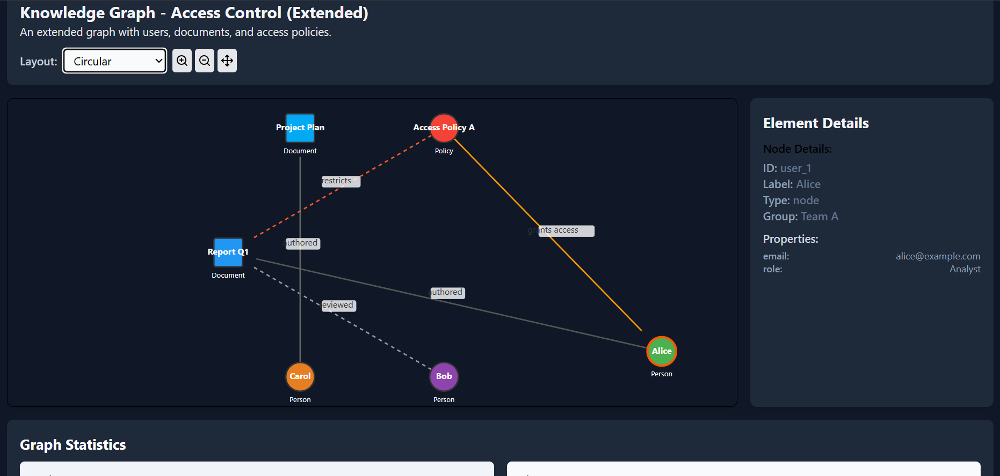

# GraphViewer

**Author:**  
**Full Name:** E. Rohit Reddy  
**GitHub Username:** [rohit20047](https://github.com/rohit20047)  
**Email:** rohithreddyedulla@gmail.com  

---

## 🌐 Project Overview

**GraphViewer** is an interactive React-based application for visualizing knowledge graphs.  
It supports multiple layouts (force-directed, circular, grid), node/edge interactions, zooming, and detailed statistics.  
Designed to be modular, reusable, and easy to extend.

### 📊 Graph Viewer Interface

### ⚙️ Controls and Details Panel

---

## 🚀 Live Demo

👉 [Deployed Link](https://dancing-cannoli-2d91fb.netlify.app/)

---

## 📽️ Demo Video
[Demo Link](https://drive.google.com/file/d/1wLbN7fFenNdvjKvj38CgCDXO8Jkvmoh9/view?usp=sharing)

## 🛠️ Libraries and Tools Used

- **React**: UI library for building reusable components.
- **Lucide-React**: Icon library for controls (zoom, reset).
- **Tailwind CSS**: Utility-first framework for responsive UI.
- **Babel**: Used for in-browser JSX transpiling via CDN.
- **jsDelivr CDN**: Loads React, ReactDOM, Lucide, and Tailwind with no build step.
- **SVG**: Rendering engine for nodes and edges.

---

## 🧠 Design Decisions

- **Component Modularity**: App is divided into clean components:  
  `App`, `GraphViewer`, `GraphRenderer`, `Node`, `Edge`, `Controls`, `DetailsPanel`, `StatisticsPanel`.

- **Centralized State**: Managed inside `GraphViewer` for simplicity and better prop flow.

- **Custom Force-Directed Layout**: Implemented using `setInterval` for animated positioning.

- **SVG Rendering**: Chosen over Canvas for finer control and React-friendly rendering.

- **CDN-Based Setup**: Enables lightweight, build-free deployment and easy testing.

- **Tailwind CSS**: Fast UI dev with minimal custom CSS.

- **Extensibility**: Easily add new layouts, node shapes, or interactions with modular structure.

---
