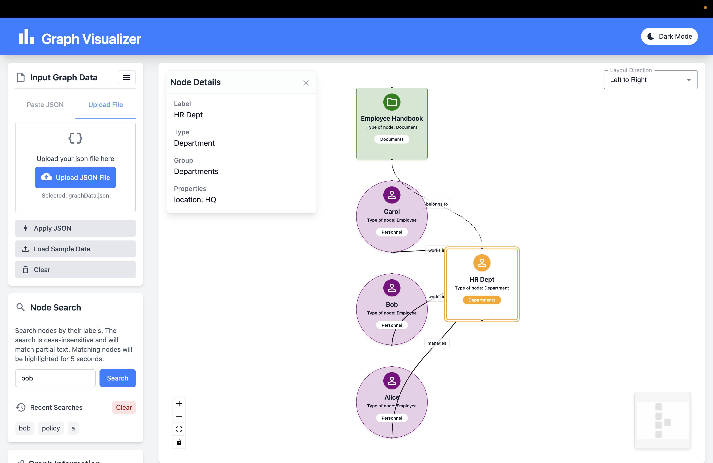
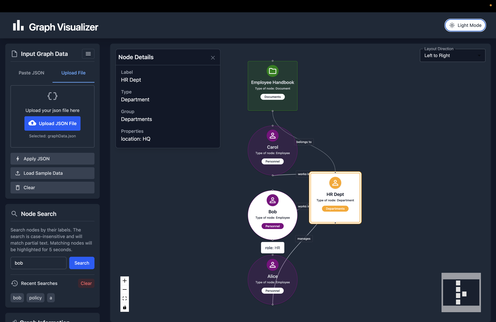
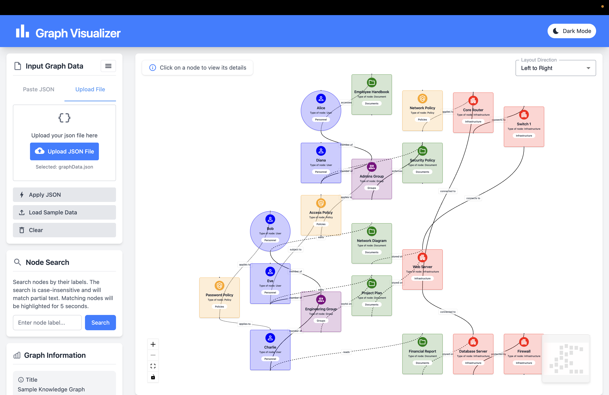

# Graph Crafter

## Details

- Full name: Sargun Pal Singh Kohli
- Github Username: sargunkohli152
- Email: sargunkohli152@gmail.com

## Libraries / Tools Used

- React 18
- TypeScript
- React Flow
- Dagre (for graph layout)
- Tailwind CSS
- MUI (icons ans a few other styles)
- Vite (build tool)
- Zustand (state management)
- Vercel (deployment)

## Short Description of Design Decisions

This project implements an interactive graph UI that renders complex graphs from JSON input. I chose React Flow for its powerful graph visualization and interactivity capabilities. Dagre was integrated to handle automatic layout for a clean and readable graph structure.

State management is handled using Zustand for simplicity, readability and reducing code complexity. Tailwind CSS was selected to rapidly style components while maintaining a consistent design.

The project is structured to allow dynamic JSON input via a collapsible sidebar, making it easy for users to switch datasets on the fly.

The app is deployed on Vercel for fast and reliable hosting.

---

## Deployed Link

[https://graph-ui-problems-theta.vercel.app/](https://graph-ui-problems-theta.vercel.app/)

## Wesbite Screenshots

Please refer to the screenshots folder for screenshots of the webiste if this doesn't open up.

## Project Details

This project is built using **React**, **TypeScript**, **Vite**, **Tailwind CSS**, and **Material-UI (MUI)** to create a highly performant and visually appealing interactive graph visualization tool.

Key features and design decisions include:

- **Performance Optimization:** Leveraged React best practices such as memoization and efficient state management to ensure smooth interactions even with complex graphs.
- **Robust JSON Handling:** Effective error handling for JSON parsing ensures the app gracefully notifies users of invalid inputs. Additionally, a JSON prettify feature formats the input for better readability and easier editing.
- **Dynamic Graph Updates:** Users can dynamically update JSON data, and the graph updates in real-time without reloads.
- **State Handling:** Proper handling of UI states like dark mode toggle and responsiveness across devices ensures a seamless user experience.
- **User Experience (UX):** Prioritized clarity and intuitiveness in UI design. The codebase is modular and clean for maintainability.
- **Advanced React Flow Usage:**
  - Full control over graph panning, zooming, and interaction.
  - Custom node components with hover states for better interactivity.
  - Customized and animated edges that reflect data-driven styles such as dashed, dotted, or solid lines.
  - Different node shapes and styles tailored to the dataset.
- **Additional Features:**
  - Dark mode support.
  - Node search functionality with highlighted results.
  - On-click node property popup displaying detailed node information.
  - Layout selection feature allowing users to switch between left-to-right and top-to-bottom graph layouts.
  - Graph metadata display, including total nodes and edges, dynamically calculated from JSON.
  - Includes 7 sample JSON datasets to explore various graph structures.
- **UI Accessibility:** All features are accessible via a collapsible sidebar panel, making the app robust and user-friendly.

Overall, this app showcases a scalable, dynamic, and polished graph visualization solution using React Flow and complementary modern web technologies.
