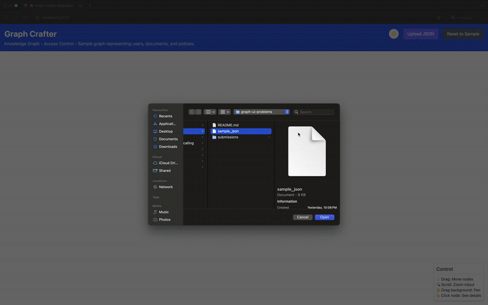

# Graph Crafter Submission

## Developer Information
- **Full Name**: Aditya Tarale
- **GitHub Username**: AdityaTarale
- **Email**: tarale.adi@gmail.com

## Libraries/Tools Used
- React
- D3.js
- Tailwind CSS
- TypeScript

## Design Decisions
I built a responsive React single page application with D3.js for force-directed graph visualization. The design focuses on user experience with intuitive pan/zoom controls, tooltips for node properties, and detailed sidebar for selected nodes. The visualization respects all JSON styling properties including node shapes, colors, and directional edges.

##  Deployed link
[https://graph-crafter.netlify.app/](https://graph-crafter.netlify.app/)

##  Demo video
