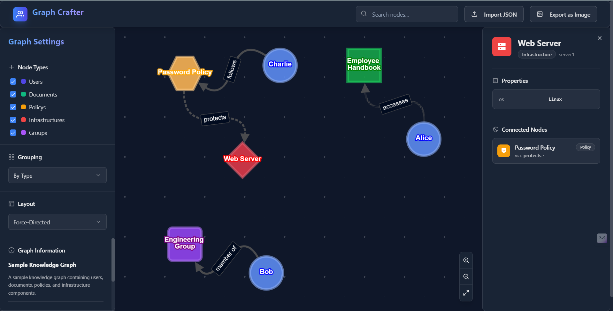

# Graph Crafter Submission

**Full Name:** ABHISHEK RAI

**GitHub Username:** [Bazuga02]

**Email:** [abhirai1802@gmail.com]

---

## Libraries/Tools Used

- React
- Cytoscape.js
- Tailwind CSS
- Vite
- TypeScript
- Radix UI (for some UI components)

---

## Short Description of Design Decisions

- **Graph Rendering:** Used Cytoscape.js for efficient, interactive, and highly customizable graph visualization. This allows for pan, zoom, and dynamic styling of nodes/edges.
- **UI/UX:** Built with React and Tailwind CSS for a modern, responsive, and accessible interface. Sidebar and TopNavbar provide easy access to graph controls and import/export features.
- **JSON Handling:** The app robustly parses and validates the input JSON, supporting all required node/edge attributes and optional styling.
- **Interactivity:** Node and edge tooltips, search, grouping, and export as image are all supported for a rich user experience.
- **Styling:** Custom color themes, dark mode, and shape support are implemented via Tailwind and Cytoscape style extensions.

---

 Deployed Link

