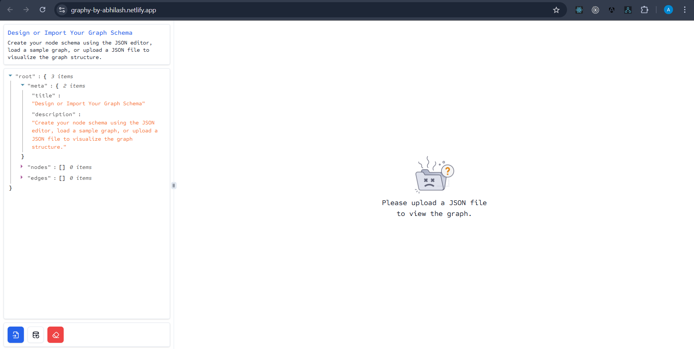
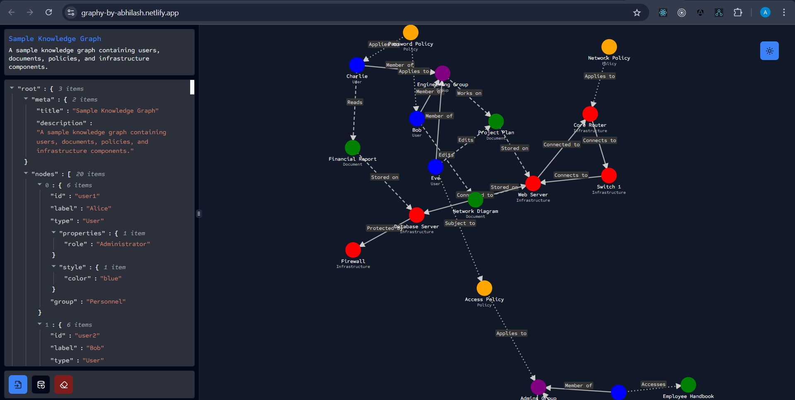
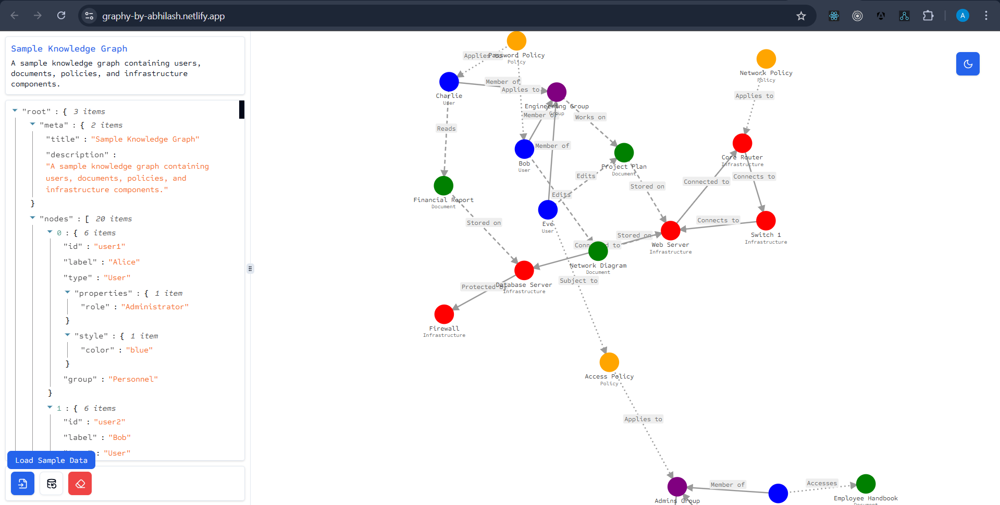
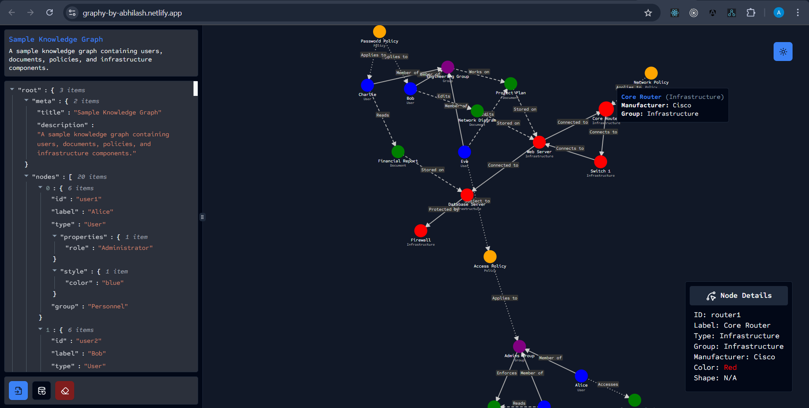
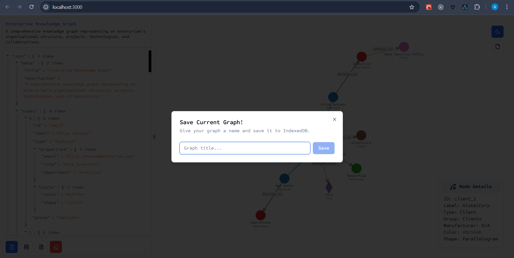
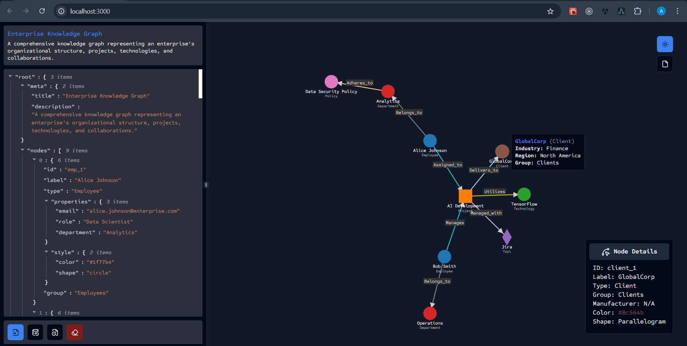
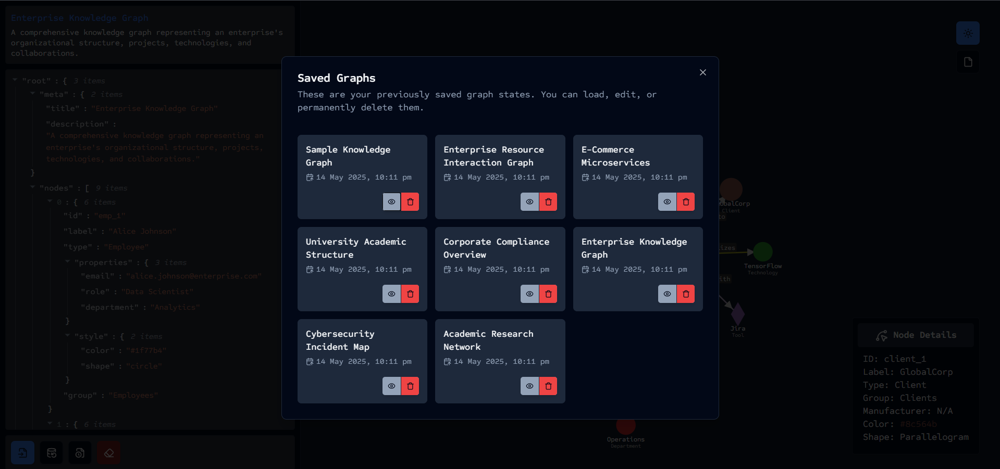

# Submission: Interactive Knowledge Graph Visualization

A dynamic and visually interactive graph editor and viewer designed to model relationships between users, documents, policies, infrastructure, and tools using a force-directed graph layout.

---

## Links

- **Live Demo**: [https://graphy-by-abhilash.netlify.app](https://graphy-by-abhilash.netlify.app)
- **Source Code**: [https://github.com/AbhilashMadi/graph-ui-problems](https://github.com/AbhilashMadi/graph-ui-problems)

---

## ✨ Features

- Load **sample graph data**
- **Import** `.json` graph files
- Build **custom schemas** in the embedded editor
- **Semantic visualization** based on node type, group, and style
- Node **glow highlight** on click
- **Hover previews** to show node summaries
- **Light/Dark mode** toggle
- **Animated edges** with directional cues
- **Draggable** nodes
- **Zoom & Pan** capabilities
- **JSON editor** for live graph modification
- **Save Graph As SVG**
- **Seeded sample** graphs
- **Save Graph** for later view
- **Search & Filter** support
- Group-based rendering
- Clean, scalable, and readable **code structure**

---

## Developer Info

- **Full Name**: Madi Abhilash
- **GitHub**: [@AbhilashMadi](https://github.com/AbhilashMadi)
- **Email**: madiabhilash1563@gmail.com

---

## Tech Stack

- **Frontend**: React, TypeScript
- **Styling**: Tailwind CSS, shadcn/ui (Radix UI)
- **Graph Engine**: D3.js
- **Validation**: Zod
- **JSON Editor**: react-json-viewer

---

## Design Decisions

- Leveraged **D3.js** for flexible and physics-based force-directed graph rendering.
- Used **Zod** to strongly validate imported JSON data and editor inputs.
- Created a **component-driven UI** using `shadcn/ui` for consistency and accessibility, scale.
- Ensured **UX clarity** with hover summaries, click highlights, and theme support.
- Wrote **clean, modular code** with extensibility in mind for future plugins (e.g., export, minimap).

---

## Demo Images

<!-- Add screenshots here if available -->

---
